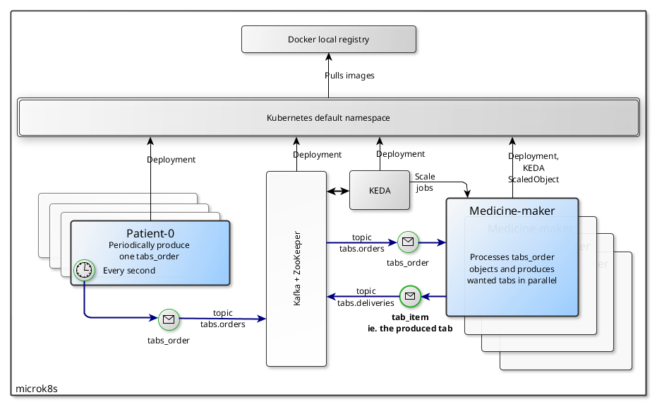

# Medicine PubSub devops challenge

Trying to fight against a epidemy, we must provide with **on demand** medicine tabs production.     
Our system must allow additional patients to request tabs without human manual *scale up* action, nor service level degradation.

# Documentation
Please see :
- [Functional specs](WORK_SUMMARY.md) for a quick overview of what the system is doing, and main problems that it overcomes
- [Technical specs](documentation/README.md) for in-depth description 

# Quick start
## Prerequisites
Technical stack :
- **Minikube running** with `minikube start --cpus=6 --memory=8g`
- Docker
- `kubectl`
- `bash`

Optional resources :
- Kafka credentials (only needed for external *Kafka* service, not used in current automatic setup)

> Default Minikube dimensions are too small, regarding the stack that is going to be deployed (*Kafka* service, *KEDA*). Please provision at least 6 CPUs and 8GB of RAM to run smoothly :
> `minikube start --cpus=6 --memory=8g`

This quickstart automatic procedure will leave you with following resources up and running, **with ONE patient producing tabs orders** :



## Prepare infra
> A [convenience script](make_infra.sh) is available for *bash*. That shell script performs all setup tasks
```shell
./make_infra.sh
```

See [detailed instructions](documentation/PREPARE_INFRA.md) and learn what this [convenience script](make_infra.sh) sets up for you :
- deploys Kafka service to kubernetes
- deploys KEDA facilities to kubernetes
- creates required topics in Kafka

## Build instructions
> A [convenience build script](make_build.sh) is available for *bash* and **minikube**. That shell script performs all build tasks
```shell
./make_build.sh
```

> **This script will be used by developers, as it updates application logic Docker images, in k8s**

See [detailed build instructions](documentation/BUILD_INSTRUCTIONS.md) and learn what this [convenience build script](make_build.sh) does for you :
- starts a local docker registry in *minikube*
- builds *patient* and *medicine* Docker images
- and tags images to local *minikube* Docker registry

## Deploy instructions
> A [convenience deploy script](make_deploy.sh) is available for *bash*. That shell script performs all deploy tasks
```shell
./make_deploy.sh
```

See [detailed deploy instructions](documentation/DEPLOY_INSTRUCTIONS.md) and learn what this [convenience deploy script](make_deploy.sh) does for you :
- deploys *patient* as a *deployment* to kubernetes
- deploys *medicine* as a *scaledJob* to kubernetes
  
# See it work
## Kafka topics
> This is the most convenient way to see thing working, as flow from every POD is visible there

Use any *kafka* POD for easy access to Kafka topics, eg. to list all topics :
```shell
kubectl exec -it medicine-pubsub-kafka-0 \
-- bin/kafka-topics.sh --list --bootstrap-server medicine-pubsub-kafka-bootstrap:9092
```

Optionally log in to Kafka bin with `kubectl exec -it medicine-pubsub-kafka-0 /bin/bash` and use same command from pod's console

### See messages going through orders topic :
Tabs orders produced by patient(s) can be seen going through `tabs.orders` topic :
```shell
kubectl exec -it medicine-pubsub-kafka-1 \
-- bin/kafka-console-consumer.sh --bootstrap-server medicine-pubsub-kafka-bootstrap:9092 --topic tabs.orders
```

### See messages going through deliveries topic :
**These are the actual produced medicine tabs going through**

Tabs items produced by medicine worker(s) can be seen going through `tabs.deliveries` topic :
```shell
kubectl exec -it medicine-pubsub-kafka-1 \
-- bin/kafka-console-consumer.sh --bootstrap-server medicine-pubsub-kafka-bootstrap:9092 --topic tabs.deliveries
```

## Logs
> This can be tricky, as each POD has logs, one would have to manually inspect multiple PODs

Get to know your setup POD names with `kubectl get pods` and find *medicine-maker-0-\** and/or *patient-0-\** PODs. 

### Patient
Get log of patient service in each *patient* POD :
```shell
kubectl logs -f <patient-0 pod name>
```

### Medicine
Get log of patient service in each *medicine maker* POD :
```shell
kubectl logs -f <medicine-maker-0 pod name>
```

## Add more patients
This current automatic setup leaves you with only ONE running patient. One can add additional patients by adding replicas to the *patient-0 deployment*:
```shell
kubectl scale -n default deployment patient-0 --replicas=<new replica count>
```
The *medicine tabs* production jobs count will scale accordingly (up or down). Indeed, setting *replicas* to 0 does pause patient tabs orders production. However, *medicine workers* will catch up enventually buffered orders.

# Yet to be done
- Refactor and use permanent consumer that creates jobs in k8s ; instead of leaving autoscaling of jobs to KEDA (coldstart, topic partitions number dependency, more realtime)