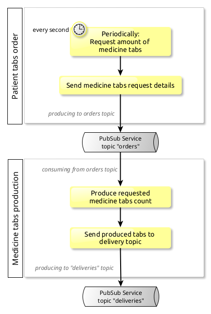
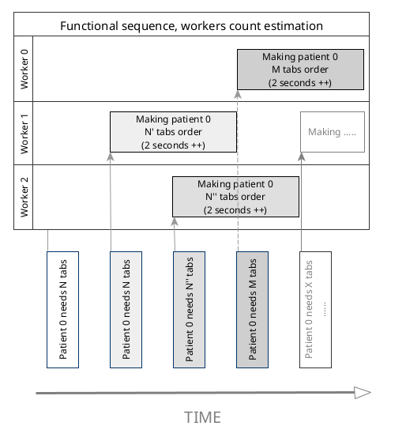

# Medicine PubSup Work Summary

## Functional need
Trying to fight against a epidemy, we must provide with **on demand** medicine tabs production.

1. _Patients_ publish _every second_ their own need of medicine tabs, between 1 and 30 tabs are needed each time
2. _Medicine makers_ are in charge of requested tabs realisation, each _tab cannot be made in less than 2 seconds_

Better than big sentences, the functional "big picture" description of the needed facility can be represented with following simplified chart, showing where functional decoupling would happen :     

## Distribution challenge
This whole system is by nature in need for _elastic_ resources, as :
- temporality involves decoupling and parallelisation
- pandemic evolution is unknown, and more patients are likely to need additional tabs

Following sequence diagram shows the actual challenge :     

Indeed, patient requests an amount of tabs **every second**, whereas **each tab takes more than 2 seconds** to be made.    

More over, this is the lightest case, where there is only one patient who requests tabs. This _3 workers needed estimation_ is for 1 patient only...

> In order to overcome this decoupling need, _Kubernetes Jobs_ can be launched on demand. These jobs allocations would be handled by cluster orchestrator.

## Auto scaling
As demonstrated, the whole facility has to lever some autoscaling features (provided by _Kubernetes_) and scale correctly without any human action.

However, regular _horizontal POD scaler_ would NOT do the job in our use case. Indeed, our _medicine makers_ (aka topic consumers) won't be using much CPU or memory, thus cannot be auto scaled by regular _Kubernetes autoscaler_ feature.

> [Keda](https://keda.sh/) would be used, and allow autoscaling based on _Kafka_ messages delivery delay.

## Functional Specifications
> Further detailed specifications can be found [here](documentation/README.md)

### Patient / producer
#### Synopsis
_Patient_ is in charge of following infinite loop :
- build a new `tabs_order` json object
- publish this crafted `tabs_order` to `tabs.orders` _Kafka_ topic
- wait 1 second (configurable) and loop

> The process builds a new `tabs_order` object periodically, frequence is configured via environment variable, at startup time

#### K8s Resource type
This _Patient_ process should run in a _docker_ container, orchestrated by _Kubernetes_ as a **Deployment** :
- no network access to micro service is needed so far
- process should remain running over long periods

### Medicine maker / consumer
#### Synopsis
_Medicine_ is in charge of ONE `tabs_order` message :
- getting only one `tabs_order` message from *Kafka* topic
- checking `tab_order` incoming payload
- parallel creation of `tab_item` json objects
- publishing crafted tabs json objects to `tabs.deliveries` *Kafka* topic, for subsequent delivery handling (out of scope)
- exit

#### K8s Resource type
This _Medicine_ process should run in a _docker_ container, orchestrated by _Kubernetes_ and `KEDA` as a **ScaledJob**, with a `Kafka` type *trigger* :
- no network access to micro service is needed so far
- process should start in a decoupled manner
- numerous jobs may be started, depending on *Patient* process activity
- process must create every tab of order in same time, and not create huge buffer needs