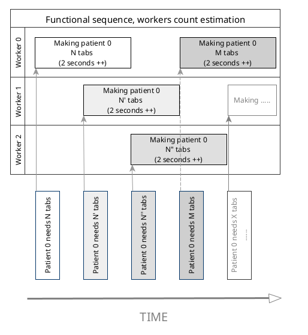

# Medicine PubSup Specifications

## Functional need
Trying to fight a pandemy, we must provide with **on demand** medicine tabs production.

1. _Patients_ publish _every second_ their own need of medicine tabs, between 1 and 30 tabs are needed each time
2. _Medicine makers_ are in charge of requested tabs realisation, each _tab cannot be made in less than 2 seconds_

Better than big sentences, the functional "big picture" description of the needed facility can be represented with following simplified chart :

## Distribution challenge
This whole system is by nature in need for _elastic_ resources, as :
- temporality involves decoupling and parallelisation
- pandemic evolution is unknown, and more pationts are likely to need additional tabs

Following sequence diagram shows the actual problem :
