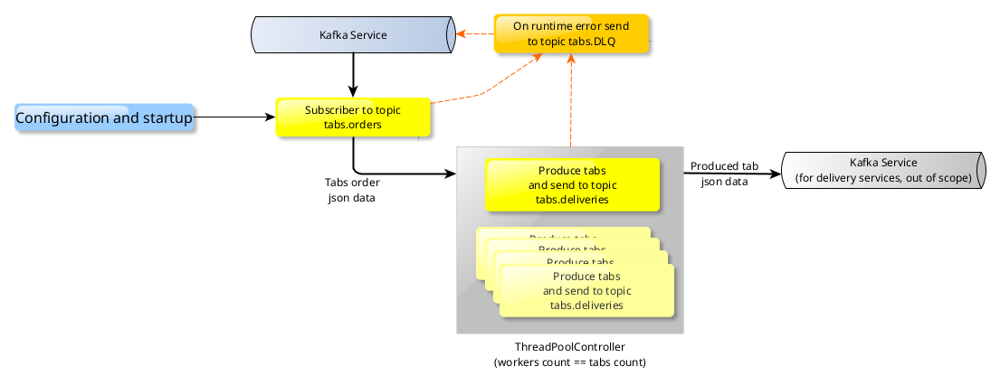

# Medicine PubSup Specifications
> Summarized documentation and quickstart is available [here](../README.md) for a more *functional* point of view

## Patient / producer
### Synopsis
_Patient_ is in charge of following infinite loop :
- build a new `tab_order` json object
- publish this crafted `tab_order` to `tabs.orders` _Kafka_ topic
- wait `ORBITAL_ORDER_PERIOD_SECONDS` seconds and loop

> Process builds a new tabs request object periodically, frequence is configured via environment variable, at startup time

### Configuration items
The _Patient_ process accepts following **editable** configuration items, at startup time :
- `ORBITAL_PATIENT_ID` *string* :                     the unique ID of the patient who makes tab request (defaults to autogenerated uuid)
- `ORBITAL_MAX_TABS_COUNT` *integer* :                the maximum number of tabs that can be requested at once for a given patient (defaults to 30 tabs)
- `ORBITAL_ORDER_PERIOD_SECONDS` *integer* :          the time in seconds between new tabs requests (defaults to 1 second)

In addition, some internal configuration items are needed :
- kafka topic to send tabs requests/orders to
- kafka topic used for DLQ
- kafka credentials

### Tabs order factory
The _Patient_ process builds a `tabs_order` *json* representation, which contains :
- `patient_id` *string* :           the ID, or name of the patient himself, configured via environment variable
- `order_timestamp_ns` *integer* :  the date (timestamp in nanoseconds) of the original tabs order
- `tabs_count` *integer* :          the number of tabs to make for this order

### K8s Resource type
This _Patient_ process should run in a _docker_ container, orchestrated by _Kubernetes_ as a **Deployment** :
- no network access to micro service is needed so far
- process should remain running over long periods

## Medicine maker / consumer
### Synopsis
_Medicine_ is in charge of :
- subscription to `tabs.orders` *Kafka* topic
- getting **only one** `tabs_order` message from *Kafka* topic
- checking `tabs_order` incoming payload
- creation of as many workers as payload's `tabs_count` with `ThreadPoolController`
- parallel distribution of tabs creation to each worker in `ThreadPool`
- creation of `tab_item` json object, one `tab_item` as per worker in `ThreadPool`
- publishing crafted `tab_item` json objects to `tabs.deliveries` *Kafka* topic, for subsequent delivery handling (out of scope)
- exit

### Configuration items
The _Medicine_ process accepts following **editable** configuration items, at startup time :
- Optional kafka servers string, when used with external service

### Tabs items factory
The _Medicine_ process reads a `tabs_order`, and crafts multiple `tab_item` *json* objects that contain :
- `patient_id` *string* :               the ID, or name of the patient for whom the tab has been made
- `order_timestamp_ns` *integer* :      the date (timestamp in nanoseconds) of the original tabs order
- `delivery_timestamp_ns` *integer* :   the date (timestamp in nanoseconds) at which the tab has been delivered to *delivery topic*
- `order_tabs_count` *integer* :        the number of tabs requested in current order
- `seq_in_order` *integer* :            the sequence number of currently being produced tab
- `tab_pow` *string* :                  a proof of work, not to wait 2s in vain

> The *proof of work* in `tab_pow` of `tab_item` actually stands for the material realization of tab. This is currently an unique `sha256` of `patient_id`+`order_timestamp_ns`+`seq_in_order`.

### K8s Resource type
This _Medicine_ process should run in a _docker_ container, orchestrated by _Kubernetes_ and `KEDA` as a **ScaledJob**, with a `Kafka` type *trigger* :
- no network access to micro service is needed so far
- process should start in a decoupled manner
- numerous jobs may be started, depending on *Patient* process activity
- process must create every ordered tab in parallel, and not create huge buffered needs